<h1> <a href="https://adrielluniere.github.io/Portfolio-atualizado/"> Portfólio </a></h1>

# Tecnologias usadas para desenvolvimento

<!--  -->
  

# Screenshots - Desktop

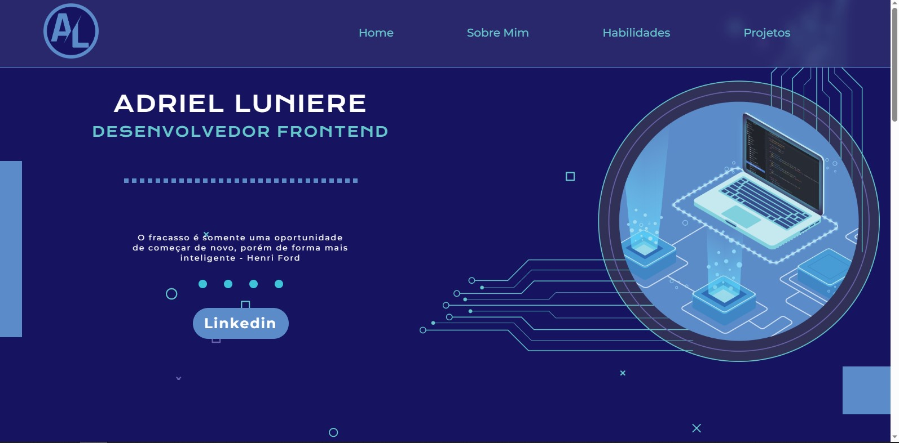
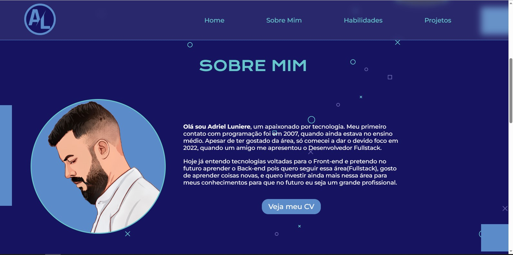
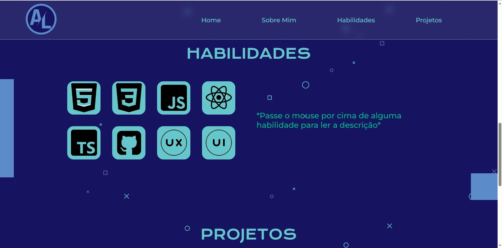
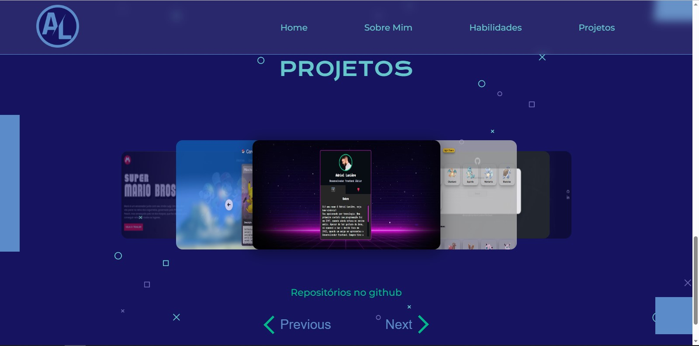
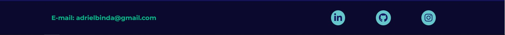

 

# Screenshots - Mobile

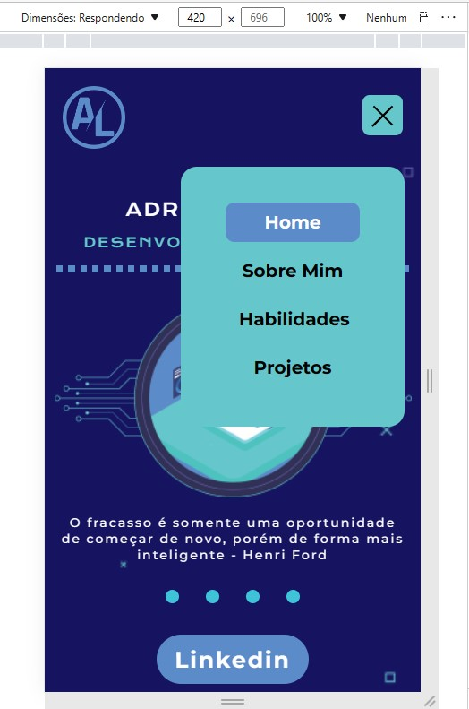
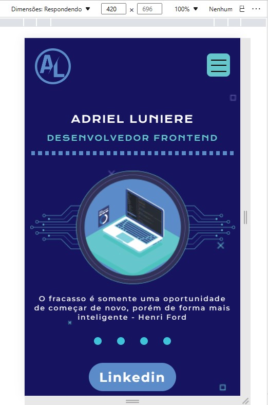
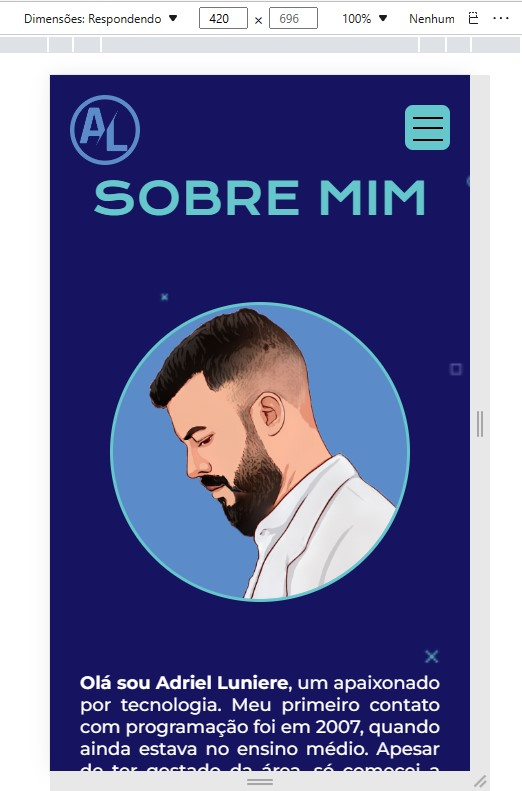
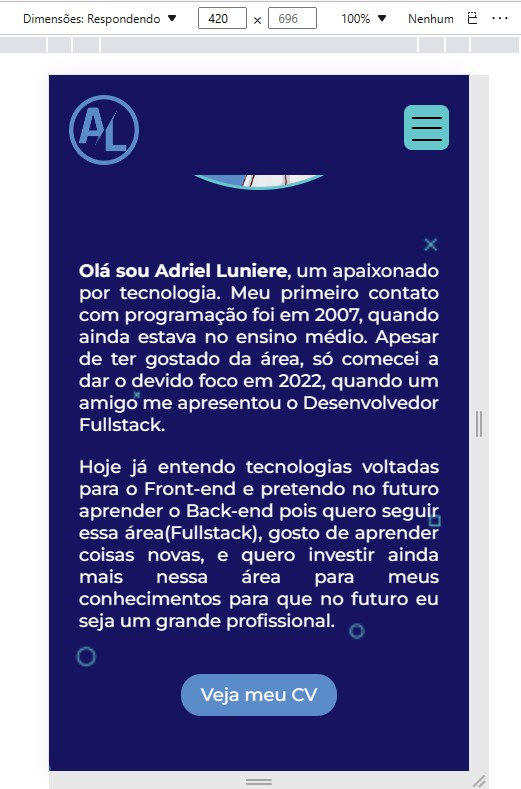
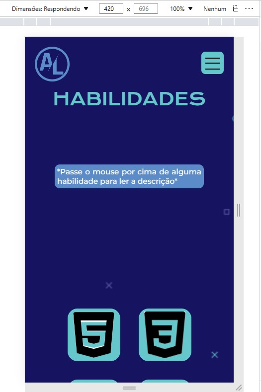
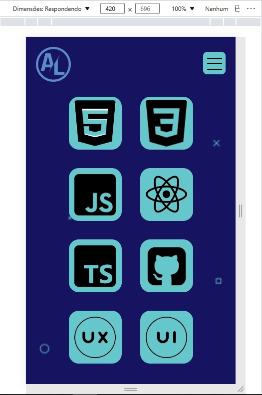
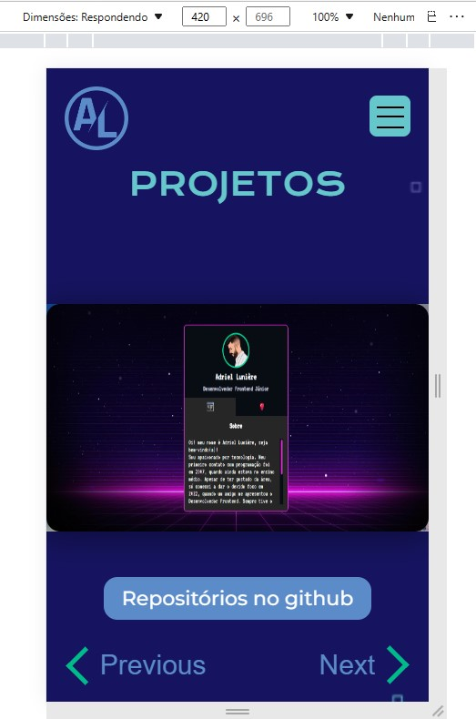
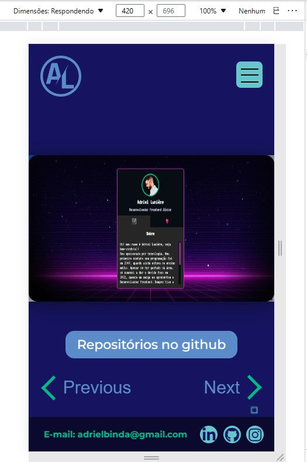

 

  

  

<h2>:bookmark_tabs: Descrição</h2>

Meu portfólio. Aplicação criada para mostrar os projetos que irei desenvolver a longo da minha carreira.

# Informativo

 A conclusão desse portfólio foi incrível para mim, tive um pouco de dificuldade no desktop, mas creio que vou melhorar ainda mais, pois sou capaz de aprendizado rápido. 
Minha maior dificuldade foi na parte responsivo, tive que passa um tempo parado para estudar ainda mais a documentação, pois não estava conseguindo tirar alguns bugs. Hoje já consegui resolver.
Não vejo a hora de fazer o portfolio2.0 mudando todo designer, porém com a tecnologia React, quero me aprofundar ainda mais na área, pois sei que serei uma grande profissional.

<h3>Ao clicar na imagem do figma, você será redirecionado a pagina onde foi criado o designer do portfolio</h3>

  

<h2>:hammer: Créditos</h2>
<table>
  <tr>
    <td align="center">
      <a href="https://github.com/AdrielLuniere">
         
        
          <b>Adriel Lunière</b>
        
      </a>
    </td>
  </tr>
</table>

<h2>:dollar: Licença</h2>
<b>MIT License.</b>
