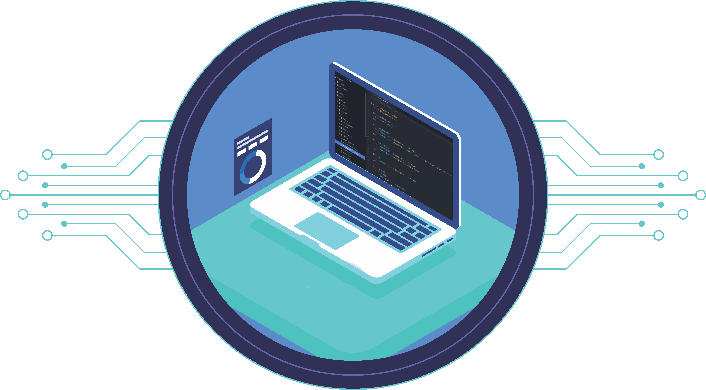

# Portfólio Professional | Adriel Luniere

> **Desenvolvedor Full Stack** apaixonado por criar soluções que vivem e evoluem na internet. Especialista em construir produtos digitais modernos, performáticos e centrados na experiência do usuário.

---

## 🚀 Sobre Mim

Olá! Sou **Adriel Luniere**. Meu interesse por desenvolvimento começou ainda no ensino médio, e hoje atuo no desenvolvimento de aplicações web completas. Trabalho tanto na camada de interface quanto na lógica de negócio, sempre priorizando **clean code**, **arquitetura escalável** e **boas práticas de UI/UX**.

Atualmente estou focado em:

- Desenvolvimento de aplicações SaaS
- Automações e integrações de API
- Criação de interfaces responsivas e acessíveis

---

## 🛠️ Tecnologias

Minha stack principal de desenvolvimento envolve tecnologias modernas para entregar soluções robustas.

  
  
  
  
  
  
  
  

---

## 💻 Projetos Recentes

Aqui estão alguns dos projetos de destaque que desenvolvi, demonstrando minhas habilidades em frontend, backend e arquitetura de software.

### 1. SaaS Gerenciamento de Boletos

**Stack:** Next.js 16, TypeScript, Tailwind, Prisma, NextAuth.
Um sistema completo para gestão financeira e emissão de boletos, com dashboard administrativo e autenticação segura.

### 2. Disparador WhatsApp com Fluxos Automáticos

**Stack:** Node.js, React, TypeScript, SQL.
Solução para automação de marketing e comunicação, permitindo a criação de fluxos de mensagens automáticas via WhatsApp.

### 3. Fan Page The Last of Us

**Stack:** HTML5, CSS3, JavaScript.
Um projeto focado em design imersivo e storytelling visual para fãs da franquia.

---

## 📬 Contato

Estou sempre aberto a novas oportunidades e parcerias. Sinta-se à vontade para entrar em contato!

  
  
  

---

  Desenvolvido com 💙 por <a href="https://github.com/AdrielLuniere">Adriel Luniere</a>

